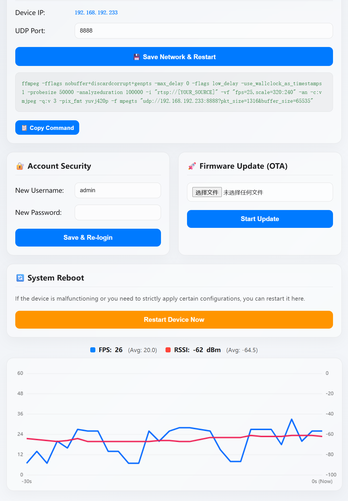

# ESP32-S3 Remote Display 📺


A lightweight and efficient remote display solution built on the **ES3C28P** (ESP32-S3) development board. This project allows you to stream video directly to the LCD screen using mpegts via FFmpeg. 

I personally use this project to cast live feeds from my security cameras onto a dedicated desktop monitor. It's perfect for creating a low-cost, low-latency smart home dashboard or a mini surveillance station.

## ✨ Key Features
* **mpegts Video Streaming**: Decodes and displays real-time mpegts streams over UDP.
* **Powered by ESP32-S3**: Utilizes the dual-core processor and PSRAM for smooth decoding and DMA-accelerated display updates.
* **Simple Integration**: Easily push video streams from any source (Linux, Raspberry Pi, Windows) using standard FFmpeg commands.
* **Low Latency**: Designed to minimize buffering for real-time monitoring applications.

## 🚀 How to Use (FFmpeg Example)

You can easily cast your desktop, a video file, or an RTSP camera stream to the ESP32-S3 display.

Here is an example of how to push an RTSP security camera stream to the device using FFmpeg:

```bash
ffmpeg -rtsp_transport tcp -i "rtsp://YOUR_CAMERA_IP/stream" -vf "fps=20,scale=320:240" -an -c:v mjpeg -q:v 3 -pix_fmt yuvj420p -f mpegts "udp://YOUR_ESP32_IP:8888?pkt_size=1200&buffer_size=65535"
```

## Demo

### Video


### Web


