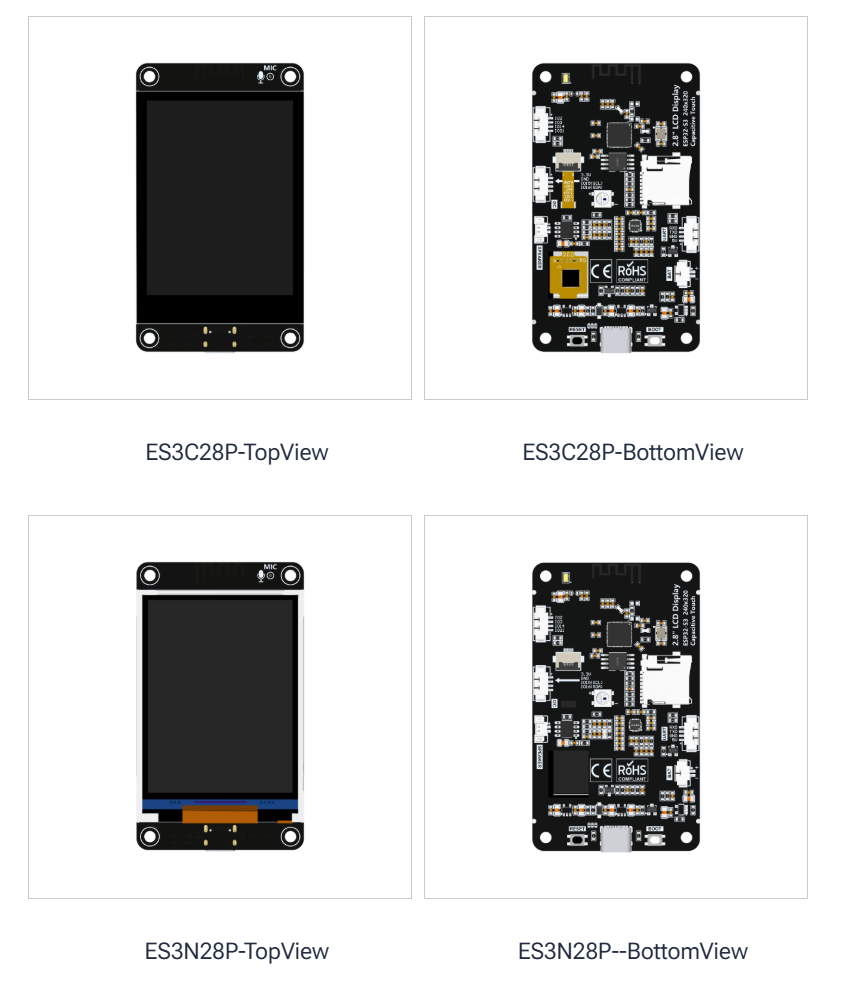
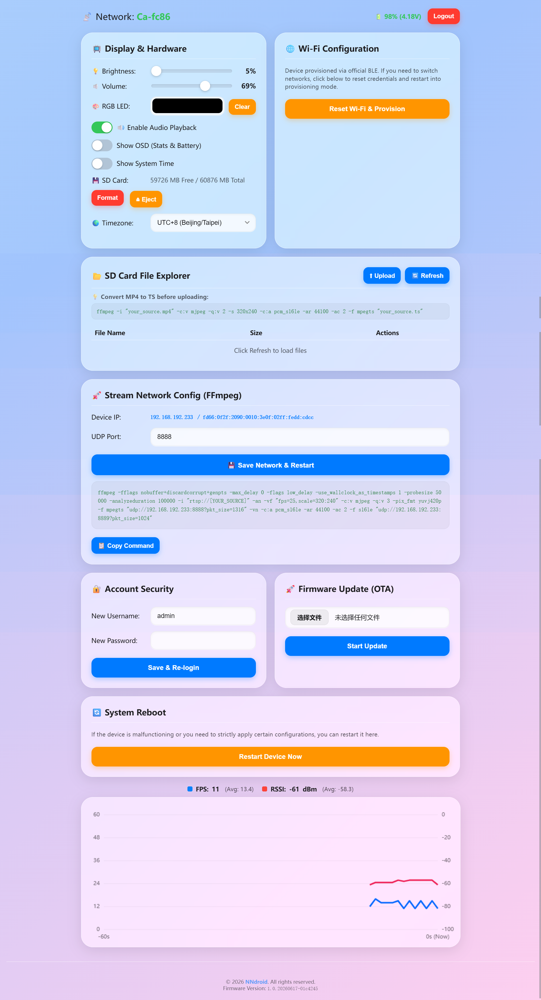

# ESP32-S3 Remote Display 📺



A lightweight, efficient, and feature-rich remote display solution built on the **ES3C28P** (ESP32-S3) development board. This project allows you to stream real-time video and audio directly to the device over Wi-Fi, or play local media from an SD Card. 

It features a modern **iOS Liquid Glass style Web Dashboard** for complete device management, making it perfect for creating a low-cost, low-latency smart home dashboard, a mini surveillance station, or a desktop media player.

## ✨ Key Features
* **High-Performance Streaming**: Decodes and displays real-time MPEG-TS (MJPEG) video streams over UDP with hardware DMA acceleration.
* **Audio Playback**: Built-in I2S audio decoding (ES8311) for synchronized sound and video.
* **SD Card Media Player**: Upload, manage, and play local `.ts` video files directly from the Web Dashboard. Includes seek/progress bar support!
* **Modern Web Dashboard**: A stunning iOS 26 "Liquid Glass" styled web interface to control brightness, volume, RGB LED, and network settings.
* **System Monitoring**: Real-time charts for Wi-Fi RSSI, FPS, CPU load, and battery voltage.
* **OTA Firmware Update**: Flash new firmware directly via the browser without connecting a USB cable.
* **Secure Access**: Login authentication to protect your device console.

## 🚀 Network Streaming (FFmpeg Example)

You can easily cast your desktop, a video file, or an RTSP camera stream to the ESP32-S3 display.

Our system uses a dual-port UDP approach (Video on `PORT`, Audio on `PORT+1`) for maximum performance. Here is an example of pushing an RTSP security camera stream:

```bash
ffmpeg -fflags nobuffer+discardcorrupt+genpts -max_delay 0 -flags low_delay -use_wallclock_as_timestamps 1 -probesize 50000 -analyzeduration 100000 -i "rtsp://YOUR_CAMERA_IP/stream" \
  -an -vf "fps=25,scale=320:240" -c:v mjpeg -q:v 3 -pix_fmt yuvj420p -f mpegts "udp://YOUR_ESP32_IP:8888?pkt_size=1316" \
  -vn -c:a pcm_s16le -ar 44100 -ac 2 -f s16le "udp://YOUR_ESP32_IP:8889?pkt_size=1024"
```
*(Note: Replace `YOUR_ESP32_IP` with the actual IP address shown on your display or dashboard.)*

## 💾 SD Card Local Playback

You can upload video files to the SD card via the Web Explorer. Before uploading, please convert your `mp4` or `mkv` videos to our supported `.ts` (MPEG-TS + MJPEG + PCM) format:

```bash
ffmpeg -i "your_source.mp4" -c:v mjpeg -q:v 2 -s 320x240 -c:a pcm_s16le -ar 44100 -ac 2 -f mpegts "your_source.ts"
```

## Demo

### Video


### Web

